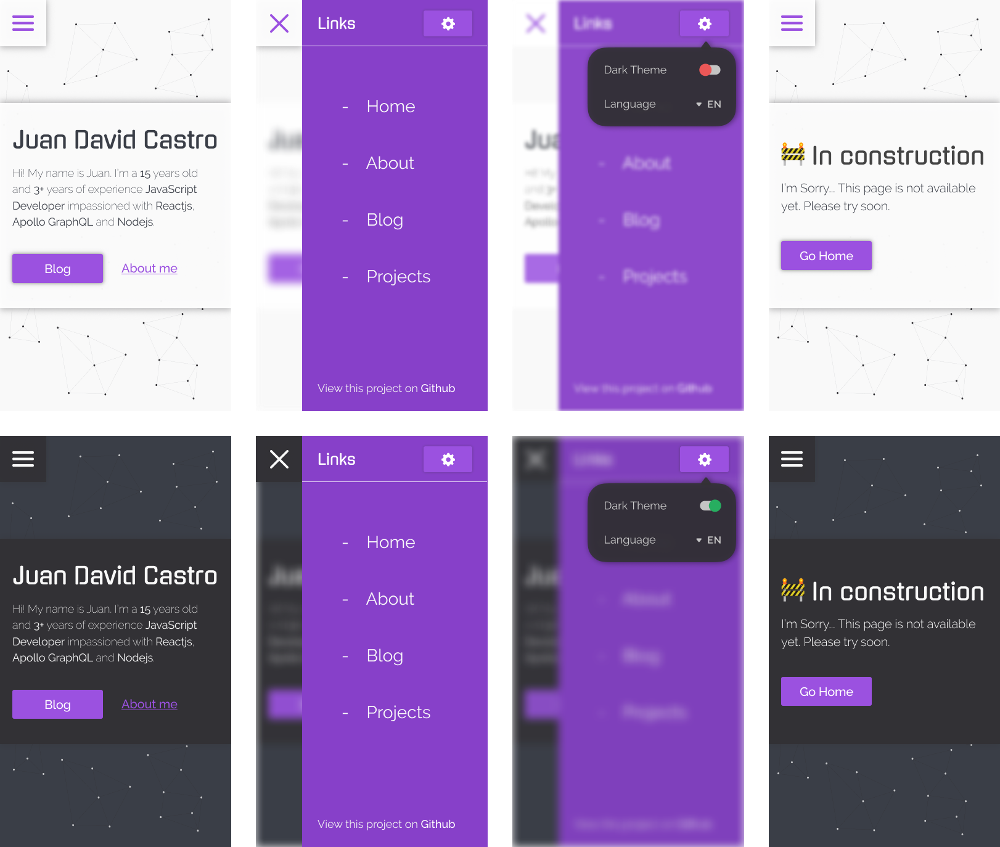
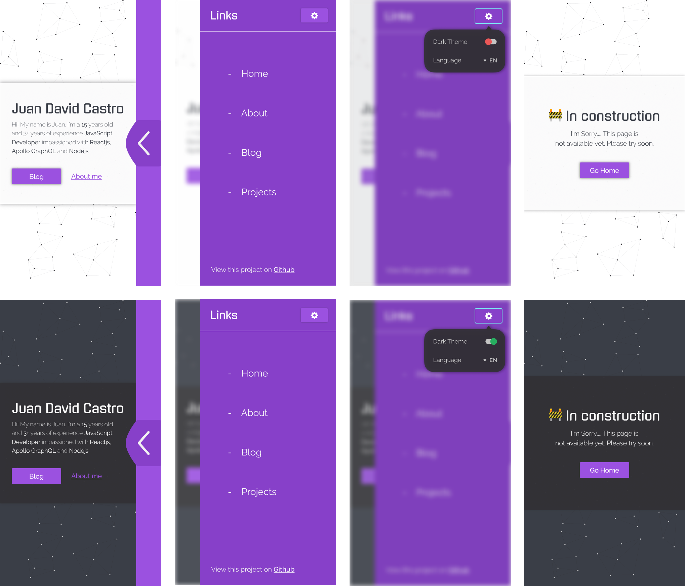
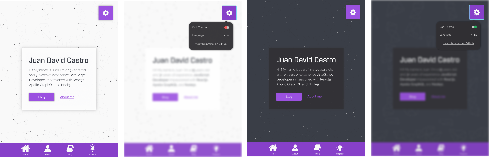
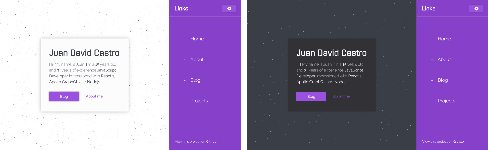

# My personal page 🎉

`juandc.co@3.0.0`

## Index

* [Sections](#sections)
  * [Home](#home)
  * [About me](#about-me)
  * [Blog](#blog)
  * [Projects](#projects)
  * [Education](#education)
* [Design](#design)
  * [Components](#components)
  * [Pages](#pages)
* [Development](#development)
  * [Storybook](#storybook)
  * [Website](#website)
* [Future Features](#future-features)

## Sections

This are the sections :D

### Home

bla bla bla

### About me

bla bla bla

### Blog

bla bla bla

### Projects

bla bla bla

### Education

bla bla bla

## Design

The Design Proposal :o

* [ ] :repeat: **UI Kit**
* [ ] :heavy*check_mark: **Ultra small** :: \_375x667 (iPhone 8)*
* [ ] :heavy*check_mark: **Mobile** :: \_480x853 (custom)*
* [ ] :cheese: **Tablet** :: _375x667 (iPad Pro portrait)_
* [ ] :cheese: **Desktop** :: _375x667 (iPad Pro landscape)_
* [ ] :confused: **Giant** :: _375x667 (iMac)_

### Components

* Component 1
* Component 2
* Component 3

### Pages

## Future Features

Big data!
